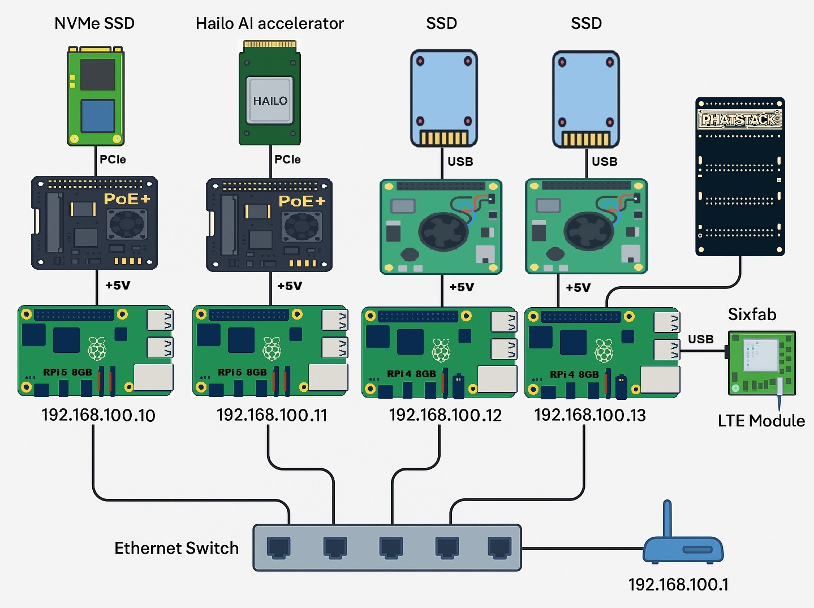

# 🧩 Cluster Automation

A fully automated Ansible-driven cluster: **K3s**, **GlusterFS** distributed storage, and **Prometheus + Grafana** monitoring, across two supported targets — a four-node **Raspberry Pi** bare-metal cluster (handling everything from **NVMe flashing** and **PXE boot configuration** onward) and a four-node **x86 Linux cluster** (pre-provisioned VMs or containers — Proxmox LXC, KVM, cloud instances, etc. — configuration only).



Full documentation lives in [`docs/`](docs/):

| Doc | Covers |
|-----|--------|
| [docs/introduction.md](docs/introduction.md) | Project goals and overview |
| [docs/hardware.md](docs/hardware.md) | Physical nodes, network topology, power |
| [docs/architecture.md](docs/architecture.md) | Software layers, Ansible conventions, repository layout |
| [docs/vault.md](docs/vault.md) | Secrets management setup |
| [docs/provisioning.md](docs/provisioning.md) | Raspberry Pi from-scratch setup sequence, maintenance, recovery |
| [docs/x86_linux.md](docs/x86_linux.md) | x86 Linux (VM/container) target: prerequisites and playbook sequence |
| [docs/pve_linux.md](docs/pve_linux.md) | Proxmox host + guests: basic SSH/update tasks only (no Docker/K3s) |
| [docs/commands.md](docs/commands.md) | Full playbook command reference |
| [docs/monitoring.md](docs/monitoring.md) | Prometheus + Grafana architecture |
| [docs/development.md](docs/development.md) | Dev tools, required collections, roadmap |

## Quick start

```bash
# 1. Install collections
ansible-galaxy collection install -r ansible/collections/requirements.yml

# 2. Set up vault (see docs/vault.md)
openssl rand -base64 32 > ~/.vault_pass.txt && chmod 600 ~/.vault_pass.txt

# 3. Follow docs/provisioning.md from Phase 1
```

## License

[MIT](LICENSE)

## Maintainer

**Author:** Ovidiu
**Location:** Romania
