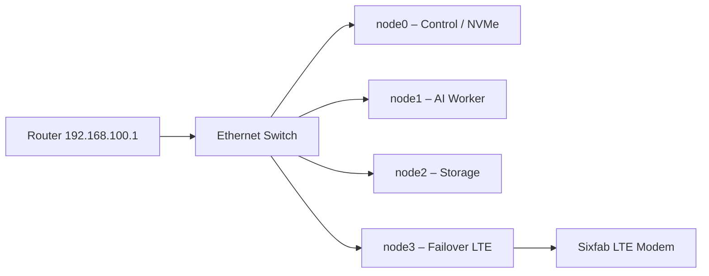

# Hardware

## Nodes

| Node | Model | Role / Function | IP Address | Storage | Peripherals |
|------|--------|----------------|-------------|----------|--------------|
| **node0** | Raspberry Pi 5 (8 GB) | Control node, PXE/NFS server, NVMe storage | `192.168.100.10` | NVMe SSD (16 partitions A/B for all nodes) | PoE+ HAT w/ fan |
| **node1** | Raspberry Pi 5 (8 GB) | AI workloads / K3s worker | `192.168.100.11` | NVMe partition (A/B boot via PXE) | Hailo AI accelerator (M.2) |
| **node2** | Raspberry Pi 4 (8 GB) | GlusterFS brick + K3s worker | `192.168.100.12` | External SSD (USB 3.0) | PoE HAT |
| **node3** | Raspberry Pi 4 (8 GB) | GlusterFS brick + Network failover (LTE) | `192.168.100.13` | External SSD (USB 3.0) | Sixfab LTE modem (USB), Phat Stack HAT |

**Network Gateway:** `192.168.100.1`
**Switch:** Netgear GS305EP — Gigabit PoE+ Ethernet Switch (5 ports)

Power is supplied via **PoE+** on Pi 5s and 5 V USB on Pi 4s. All nodes are on the same LAN subnet, with node3 capable of policy-based routing for LTE failover.

Only node0 has a real NVMe drive attached; it's partitioned into A/B slot pairs for every node (see [architecture.md](architecture.md#nvme-ab-partition-layout)) and exports the other nodes' root filesystems over NFS/PXE.

## Network Topology

- **Primary gateway:** via router `192.168.100.1`
- **Backup gateway:** LTE modem on node3 (`eth1`)
- **Failover logic:** Policy-based routing (wired = priority 100, LTE = priority 200) — see [architecture.md](architecture.md#network--lte) for the `lte_gateway` role details.
