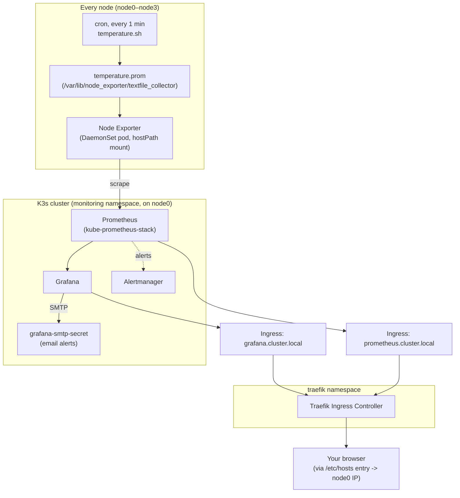

# Monitoring and Observability

The monitoring stack is deployed entirely inside K3s via Helm (`k3s_monitoring_stack` role) and extended with per-node CPU temperature metrics (`rpi_cpu_temp_mon_kube` role). Everything runs on `node0` (the K3s control plane); worker nodes only run a lightweight Node Exporter DaemonSet pod and a cron job.

## Architecture



## Deployment (`k3s_monitoring_stack` role)

| Step | What happens |
|------|---------------|
| 1. Prerequisites | Installs Helm (apt repo), creates the `monitoring` namespace, ensures `k3sadmin` user/group and kubeconfig exist |
| 2. Prometheus | Adds the `prometheus-community` Helm repo, installs/upgrades the `kube-prometheus-stack` chart (Prometheus + Alertmanager + Grafana + a bundled Node Exporter DaemonSet), release name `monitoring` |
| 3. Grafana | Waits for the Grafana Deployment rollout (Grafana ships as part of the same `kube-prometheus-stack` chart) |
| 4. Traefik | Skips install if K3s's packaged Traefik is already present (default); otherwise installs the `traefik/traefik` chart as the default `IngressClass` |
| 5. Ingress | Templates and applies two `networking.k8s.io/v1 Ingress` objects — one for Grafana, one for Prometheus — routed through Traefik |

Both ingress hostnames are also appended to `/etc/hosts` **on the Ansible control machine** (not on the cluster nodes) pointing at node0's LAN IP, since there's no real DNS server resolving `*.cluster.local`.

## CPU temperature metrics (`rpi_cpu_temp_mon_kube` role, extends the stack above)

```
cron (every 1 min)
  └─ temperature.sh                                    (reads /sys/class/thermal/thermal_zone0)
       └─ temperature.prom   (textfile_collector dir)
            └─ Node Exporter (DaemonSet, hostPath mount)
                 └─ Prometheus scrape
                      └─ Grafana dashboard (node_cpu_temperature_celsius)
```

This role also creates the `grafana-smtp-secret` Kubernetes secret (email alerting) and re-runs `helm upgrade` on the same `monitoring` release with additional values: the Node Exporter `--collector.textfile.directory` flag and Grafana SMTP settings. Use `rpi_cpu_temp_mon_bare` instead when K3s isn't running (installs Node Exporter as a native systemd service).

`grafana_smtp_password` is sourced from the `GRAFANA_SMTP_PASSWORD` environment variable rather than vault — see [vault.md](vault.md) for why this one secret bypasses the vault pattern.

## Accessing Grafana and Prometheus

```bash
# Via ingress (requires the /etc/hosts entry the role already added on your control machine)
open http://grafana.cluster.local
open http://prometheus.cluster.local

# Or port-forward directly, bypassing ingress
kubectl port-forward -n monitoring svc/monitoring-grafana 3000:80
kubectl port-forward -n monitoring svc/monitoring-kube-prometheus-prometheus 9090:9090
```

Grafana's admin password is **not** a fixed default — it's generated by the Helm chart and stored in a Kubernetes secret:

```bash
kubectl get secret -n monitoring monitoring-grafana \
  -o jsonpath="{.data.admin-password}" | base64 -d
```

## Visualizing metrics in Grafana

**Important gap:** no dashboard is provisioned automatically today. There's a ready-made dashboard JSON at `roles/rpi_cpu_temp_mon_bare/files/cpu_temperature.json`, but no task in either `rpi_cpu_temp_mon_kube` or `rpi_cpu_temp_mon_bare` copies or applies it, and there's no Helm `dashboardProviders`/sidecar ConfigMap wiring it in either — it's dead weight. `rpi_cpu_temp_mon_kube/README.md`'s "search for CPU Temperature" instructions only work if you import it yourself first, via one of the two procedures below.

### 1. Confirm the Prometheus data source

Grafana and Prometheus are deployed together in the same `kube-prometheus-stack` Helm release, and the chart auto-provisions a default **Prometheus** data source pointing at the in-cluster service — nothing to configure. Verify it:

1. Log into Grafana (see [Accessing Grafana and Prometheus](#accessing-grafana-and-prometheus) above for the URL and admin password).
2. Left menu → **Connections → Data sources**.
3. Confirm a data source named **Prometheus** exists and shows a green "Data source is working" check when you click into it (click **Save & test**).

### 2. Fast path — import the existing CPU Temperature dashboard

The JSON at `roles/rpi_cpu_temp_mon_bare/files/cpu_temperature.json` is already in Grafana's dashboard-import format (`{"dashboard": {...}, "overwrite": true}`) with a ready-made per-node temperature panel (unit in °C, thresholds at 60°C/80°C).

1. Copy the file to your local machine (or open it directly if you have repo access from the browser's machine).
2. In Grafana: **Dashboards** (left menu) → **New** → **Import**.
3. Either paste the JSON contents into the "Import via panel json" box, or use "Upload dashboard JSON file" and select `cpu_temperature.json`.
4. When prompted for a data source, select **Prometheus**.
5. Click **Import**. The "CPU Temperature test" dashboard now appears under Dashboards, showing `node_cpu_temperature_celsius` per node.

### 3. Building a panel from scratch (any metric)

Use this for anything not already covered by a dashboard — e.g. the `resource_snapshot` facts from `cluster_monitoring`'s performance mode, or a new custom metric.

1. **Dashboards** → **New** → **New Dashboard** → **Add visualization**.
2. Select the **Prometheus** data source when prompted.
3. In the query editor, enter a PromQL expression (see the table below for examples) and set **Legend** to something like `{{instance}}` so each node gets its own line.
4. In the panel's **Field** options, set the **Unit** (e.g. Celsius, bytes, percent) and optionally **Thresholds** for color-coded alerting bands.
5. Click **Apply** to add the panel to the dashboard, then **Save dashboard** (top right) — give it a name and, optionally, a folder/tags.
6. Repeat "Add visualization" on the same dashboard to add more panels (e.g. one per metric or per node group).

### Useful PromQL queries

| Query | Description |
|-------|--------------|
| `node_cpu_temperature_celsius` | Current CPU temperature for every node |
| `avg by (instance) (node_cpu_temperature_celsius)` | Average temperature per node |
| `max_over_time(node_cpu_temperature_celsius[1h])` | Peak temperature per node in the last hour |
| `up{job="node-exporter"}` | Confirms Node Exporter scrape targets are healthy |

### Troubleshooting

- **No data / "N/A" in a panel**: check the query directly in Prometheus first — **Prometheus UI → Graph** tab, or `open http://prometheus.cluster.local`. If it's empty there too, the problem is upstream of Grafana (scrape target down, textfile collector not writing, etc.) — see `roles/rpi_cpu_temp_mon_kube/README.md`'s verification steps.
- **Data source errors**: re-run **Save & test** on the Prometheus data source (Connections → Data sources); if it fails, confirm the `monitoring-kube-prometheus-prometheus` service is up (`kubectl get svc -n monitoring`).
- **Dashboard disappeared after a Helm upgrade**: dashboards created via the UI live in Grafana's own database (a Pod-local SQLite file by default in this setup, not persisted by a `PersistentVolumeClaim`), so a Grafana pod restart/reschedule can lose manually-created dashboards. Re-import `cpu_temperature.json` if that happens, or consider adding a `PersistentVolumeClaim` for Grafana in the Helm values if this becomes a recurring problem.

See `roles/k3s_monitoring_stack/README.md` and `roles/rpi_cpu_temp_mon_kube/README.md` for the full variable reference and additional verification commands (checking the cron job, the `.prom` file, raw Node Exporter output, and Prometheus scrape target status).
